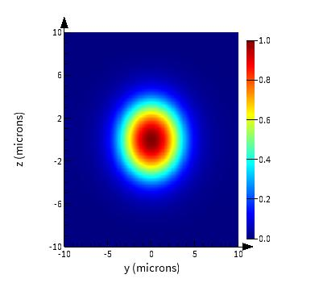
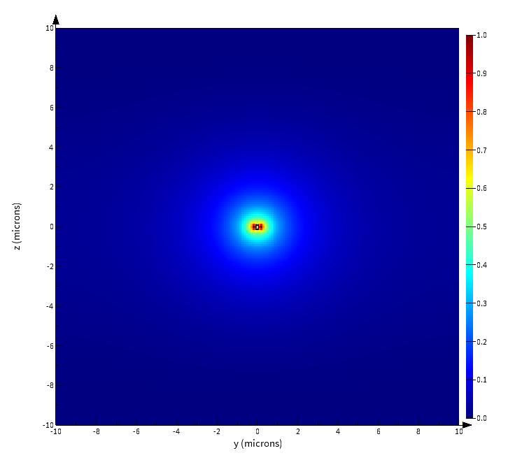
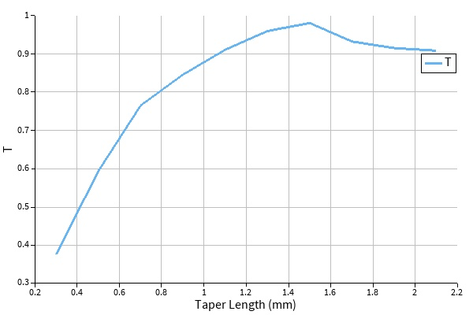

# Silicon Photonic Edge Coupler

Design and simulation of a silicon-photonic edge coupler using a parabolic inverse taper. The device was analyzed using Lumerical MODE with FDE and EME simulations.

The taper was designed to expand the tightly confined silicon-waveguide mode and improve its overlap with the mode of an SMF-28 fiber.

## Design parameters

| Parameter | Value |
|---|---:|
| Platform | Silicon photonics |
| Silicon thickness | 220 nm |
| Waveguide input width | 450 nm |
| Facet tip width | 150 nm |
| Taper profile | Parabolic |
| Cladding | SiO₂ |
| Substrate | Omitted in this initial study |
| Fiber | SMF-28 |
| Target wavelength | 1550 nm |
| Optimized taper length | 1.45 mm |

The taper width was defined as:

$$
w(z)=w_{\mathrm{tip}}+
\left(w_{\mathrm{wg}}-w_{\mathrm{tip}}\right)
\left(\frac{z}{L}\right)^2
$$

where $$w_{\mathrm{tip}}=150\ \mathrm{nm}$$, $$w_{\mathrm{wg}}=450\ \mathrm{nm}$$, and $$L$$ is the taper length.

## Main results

- FDE modal overlap with the SMF-28 mode: approximately 90%
- Optimized fiber position: centered with respect to the symmetric taper geometry
- EME taper-length sweep: 0.3–2.1 mm
- Initial optimum from the sweep: approximately 1.5 mm
- Refined optimum: approximately 1.55 mm
- Final EME transmission: approximately 99%
- Equivalent insertion loss: approximately 0.044 dB

The transmission-to-loss conversion is:

$$
\mathrm{Loss}=-10\log_{10}(T)
$$

For $$T=0.981$$:

$$
\mathrm{Loss}\approx0.083\ \mathrm{dB}
$$

## Main figures

### Mode overlap

### Taper-length sweep

## Simulation workflow

The simulations were performed using a Lumerical MODE file.

1. Open the `.lms` file.
2. Run `set_FDE.lsf`.
3. Place the SMF-28 mode and taper geometry.
4. Run `overlap_analysis.lsf` to calculate modal overlap.
5. Run `add_EME.lsf` to add the EME simulation region and power monitors.
6. Run the EME simulation using `eme propagate`.
7. For a taper-length sweep, open the `.lms` file.
8. Open `set_EME_sim_swp.lsf`.
9. Enter the desired taper-length range.
10. Run the script and extract the transmission results.

## Repository contents

- `README.md` — project overview
- `SUMMARY.md` — detailed design summary and simulation methodology
- `figures/` — mode profiles and sweep results
- `scripts/` — Lumerical `.lsf` scripts

## Tools

- Ansys Lumerical MODE
  - FDE solver
  - EME solver
## Limitations

This initial study omits the substrate and assumes an oxide-clad taper. The reported modal overlap and transmission should therefore be treated as initial design results. A more complete design would include:

- The substrate
- Full three-dimensional fabrication geometry
- Facet reflection
- Fiber tilt and vertical offset
- Taper-tip fabrication variation
- Sidewall roughness
- Alignment tolerance
- Broadband performance

## Detailed project summary

[View the detailed project summary](SUMMARY.md)
