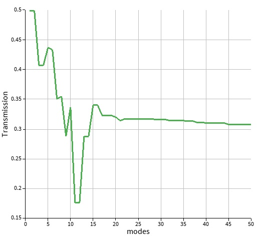
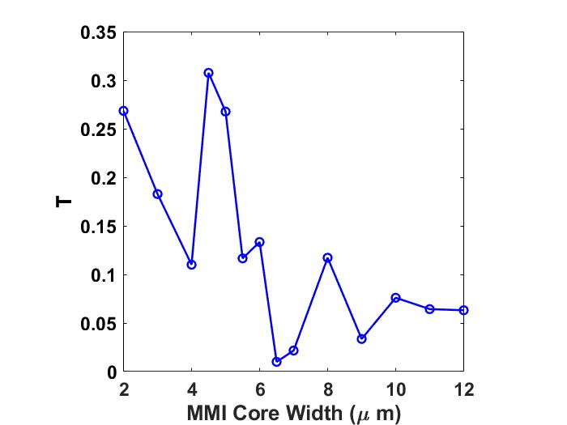
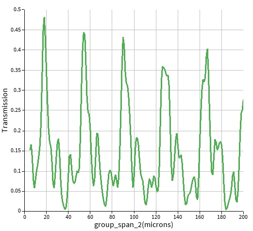
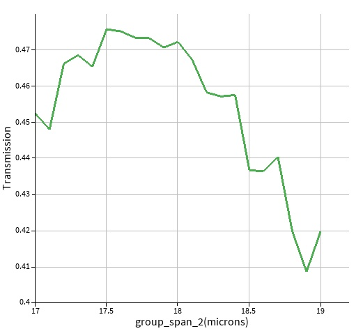
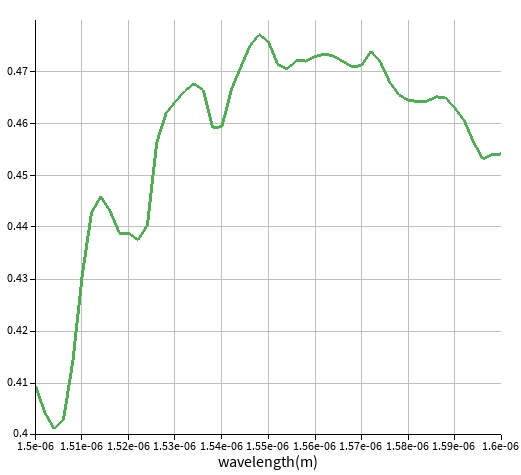
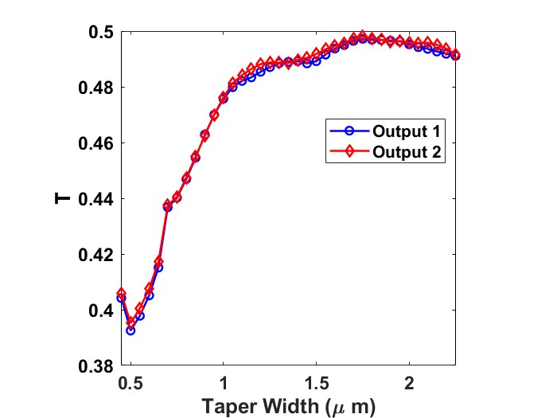
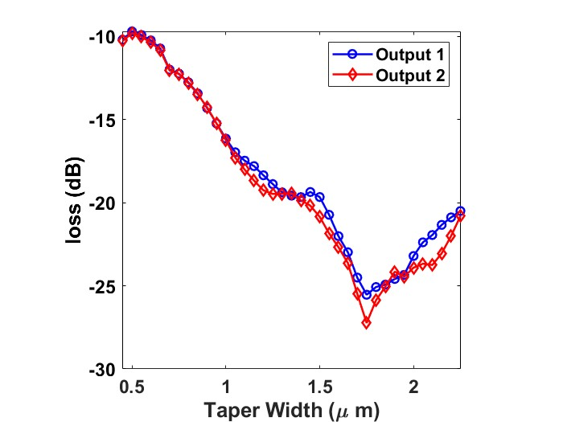
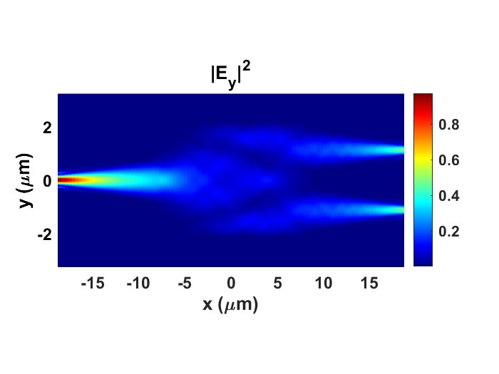

# Silicon Photonic 1×2 MMI Splitter Design

## 1. Project Overview

This project demonstrates the design and simulation of a 1×2 multimode-interference (MMI) splitter for silicon photonics.

The device consists of:

1. A single-mode input waveguide
2. A tapered input region
3. A multimode interference region
4. Two tapered output waveguides

The device was designed near 1550 nm using silicon waveguides with a nominal cross section of 220 nm × 450 nm. The design process included mode-convergence analysis, MMI-width and MMI-length optimization, wavelength sweeps, taper-width optimization, and S-parameter extraction for circuit-level modeling in INTERCONNECT.

## 2. Platform and Initial Geometry

| Parameter | Value |
|---|---|
| **Material platform** | Silicon photonics |
| **Silicon thickness** | 220 nm |
| **Nominal waveguide width** | 450 nm |
| **Background index** | 1.44 |
| **Target wavelength** | 1550 nm |
| **Initial MMI width** | 10 µm |
| **Initial MMI length** | 20 µm |

The initial structure used linear tapers between the single-mode input/output waveguides and the multimode region.

## 3. Design Objective

The objective was to design a compact and low-loss passive 1×2 splitter with approximately equal power at the two output ports near 1550 nm.

The main design targets were:

- Equal or near-equal output splitting
- Low excess loss
- Operation near 1550 nm
- Compact MMI region
- Smooth transitions between single-mode waveguides and the multimode region

For output powers $P_1$ and $P_2$, the splitting ratios can be evaluated as:

$$
SR_1 = \frac{P_1}{P_1 + P_2}
$$

$$
SR_2 = \frac{P_2}{P_1 + P_2}
$$

The output imbalance can be expressed as:

$$
\mathrm{Imbalance} = 10\log_{10}\left(\frac{P_1}{P_2}\right)
$$

## 4. Mode-Convergence Analysis

A mode-convergence sweep was performed to determine the number of modes required for reliable analysis of the multimode region.

A mode count of 50 was selected as a safe value for the subsequent simulations.

## 5. MMI-Width Sweep

The MMI width was swept to determine its effect on the output transmission and splitting behavior.

The initial MMI width was 10 µm. The sweep identified an optimized width of approximately 4.5 µm.

The width sweep showed that the MMI width strongly affects:

- Modal interference
- Output power balance
- Transmission
- Optimum operating wavelength
- Device footprint

| Parameter | Value |
|---|---|
| **Initial MMI width** | 10 µm |
| **Optimized MMI width** | 4.5 µm |
| **Width sweep range** | 2-12 µm |
| **Width sweep step** | variable 1µm - 0.5µm |

## 6. Coarse MMI-Length Sweep

The MMI length was initially swept from 5 µm to 200 µm using a 1 µm step.

This sweep was used to identify the approximate length range corresponding to high transmission and balanced output power.

The coarse sweep indicated an optimum near 18 µm.

| Parameter | Value |
|---|---|
| **Sweep range** | 5–200 µm |
| **Sweep step** | 1 µm |
| **Approximate optimum** | 18 µm |

## 7. Fine MMI-Length Sweep

A second, finer sweep was performed from 17 µm to 19 µm using a 0.1 µm step.

The refined sweep identified an optimized MMI length of approximately 17.5 µm.

| Parameter | Value |
|---|---|
| **Fine sweep range** | 17–19 µm |
| **Fine sweep step** | 0.1 µm |
| **Optimized MMI length** | 17.5 µm |

The fine sweep provided a more accurate estimate than the initial coarse sweep.

## 8. Wavelength Sweep

The transmission was evaluated over the wavelength range from 1500 nm to 1600 nm using a 2 nm wavelength step.

The optimized structure showed its best response near 1548 nm, which is sufficiently close to the target wavelength of 1550 nm for the initial design.

| Parameter | Value |
|---|---|
| **Wavelength range** | 1500–1600 nm |
| **Wavelength step** | 2 nm |
| **Target wavelength** | 1550 nm |
| **Simulated optimum** | Approximately 1548 nm |

The small offset from 1550 nm may result from:

- Discrete wavelength sampling
- Numerical approximation
- Geometrical parameter resolution
- Taper and transition effects
- Material and mode-solver assumptions

## 9. Taper-Width Sweep

The taper width was swept to evaluate the effect of the input and output transitions on device transmission and splitting.

An optimized taper width of approximately 1.75 µm was obtained.

| Parameter | Value |
|---|---|
| **Optimized taper width** | 1.75 µm |
| **Taper length** | 10  µm|
| **Taper type** | Linear |
| **Taper sweep range** | 0.45-2.25  µm |

The taper influences mode conversion between the single-mode access waveguides and the multimode interference region. An inappropriate taper can introduce mode mismatch, reflection, and excess loss.

## 10. Final Optimized Design

The final design combines the optimized MMI width, MMI length, and taper width.

| Parameter | Value |
|---|---|
| **MMI width** | 4.5 µm |
| **MMI length** | 17.5 µm |
| **Taper width** | 1.75 µm |
| **Waveguide width** | 450 nm |
| **Silicon thickness** | 220 nm |
| **Target wavelength** | 1550 nm |

| Metric | Value |
|---|---|
| **Output 1 transmission** | 0.497204 |
| **Output 2 transmission** | 0.49811  |
| **Total transmission** | 0.995315 |
| **Output imbalance** | 0.0079 dB |
| **Loss** | -23.3 dB |

## 11. Final Field Distribution

The electric-field distribution was examined using an XY cross section of the final device at the target wavelength.

The field plot illustrates:

- Input-mode propagation into the MMI region
- Multimode interference inside the central region
- Field redistribution toward the two output waveguides
- Output-port power separation

## 12. S-Parameter Extraction

The final MMI was used to extract wavelength-dependent port responses. The simulated transmission data were exported to text files for conversion into an N-port S-parameter model.

For a 1×2 passive component, the model includes:

- One input port
- Two output ports
- S-Matrix

The extracted data are organized as wavelength-dependent complex scattering parameters:

$$
S_{ij}(\lambda)
$$

where $S_{ij}$ describes the complex wave response at port $i$ due to excitation at port $j$.

The S-parameter workflow is:

1. Define the input and output ports.
2. Sweep the operation wavelength along the spectral band of interest.
3. Record S-matrix data.
4. Export the data to text files.
5. Convert the data into the required INTERCONNECT N-port format.
6. Import the model into INTERCONNECT.
7. Verify the N-port response.

## 13. INTERCONNECT Model

The extracted N-port S-parameter object will allow the MMI to be used as a circuit-level component.

Potential applications include:

- Passive power splitters
- Mach–Zehnder interferometers
- Wavelength filters
- Optical routing circuits
- Larger silicon-photonic circuit simulations

The INTERCONNECT model was compared against the original EME transmission data to verify that the exported S-parameters preserve the component response.

## 14. Conclusions

A passive silicon-photonic 1×2 MMI splitter was designed using EME simulations.

The design process included:

- Verification of the required number of modes
- MMI-width optimization
- Coarse and fine MMI-length sweeps
- Broadband wavelength analysis
- Taper-width optimization
- Final field-distribution analysis
- S-parameter extraction for circuit-level modeling

The final design uses an MMI width of 4.5 µm, an MMI length of approximately 17.5 µm, and a taper width of 1.75 µm, achieving a total loss of -23.3 dB and output imbalance of 0.0079 dB. 
