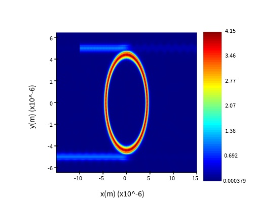

# Silicon Photonic Microring Resonator

Design and simulation of a passive silicon-photonic microring/racetrack resonator near 1550 nm using Ansys Lumerical varFDTD and FDTD.

The design targets a resonance wavelength of 1550 nm and a free spectral range (FSR) of approximately 20 nm. The group index extracted during the MZI design was used to estimate the required resonator radius.

## Project Scope

* Group-index-based resonator design
* Ring and racetrack resonator simulations
* Coupling-length comparison
* Resonance-wavelength and FSR analysis
* Quality-factor extraction
* Coupling-length sweep
* Field-distribution analysis near resonance

## Design Targets

| Parameter             | Target                 |
| --------------------- | ---------------------- |
| **Platform**          | Silicon photonics      |
| **Silicon thickness** | 220 nm                 |
| **Waveguide width**   | 450 nm                 |
| **Nominal gap**       | 150 nm                 |
| **Target wavelength** | 1550 nm                |
| **Target FSR**        | 20 nm                  |
| **Target loaded Q**   | Approximately 1500     |
| **Simulation tools**  | Lumerical varFDTD/FDTD |

## Main Results

The initial FDTD validation produced a resonance near 1552 nm with a linewidth of approximately 0.4 nm, corresponding to a loaded quality factor of approximately 3900:

```math
Q = \frac{\lambda_{\mathrm{res}}}{\Delta\lambda_{\mathrm{FWHM}}}
```

The measured FSR was approximately 21 nm. The small difference from the target values is attributed mainly to geometric rounding and numerical resolution.




## Design Conclusions

The simulations show that:

* Increasing the coupling length reduces the loaded quality factor.
* Coupling length has only a small effect on the FSR.
* The resonator radius primarily controls the FSR.
* The radius and coupling length can be jointly optimized to set the resonance wavelength, FSR, and loaded Q.

A coupling-length sweep and radius sweep were used to move the final response toward:

* **Resonance wavelength:** approximately 1550 nm
* **FSR:** approximately 20 nm
* **Loaded Q:** approximately 1500

## Design Tolerance Targets

For this simulation-based design, reasonable acceptance criteria are:

| Parameter                | Acceptance criterion |
| ------------------------ | -------------------- |
| **Resonance wavelength** | ±1 nm                |
| **FSR**                  | ±1 nm or ±5%         |
| **Loaded Q**             | ±10–20%              |
| **Linewidth**            | ±10–20%              |

These values are simulation/design tolerances rather than measured fabrication tolerances.

## Detailed Project Summary

[View the detailed project summary](Summary.md)

## Repository Contents

* `README.md` — short project overview
* `Summary.md` — detailed design methodology and results
* `figures/` — transmission plots and field maps
* `simulation_and_script_files/` — Lumerical simulation and script files

## Tools

* Ansys Lumerical varFDTD
* Ansys Lumerical FDTD
