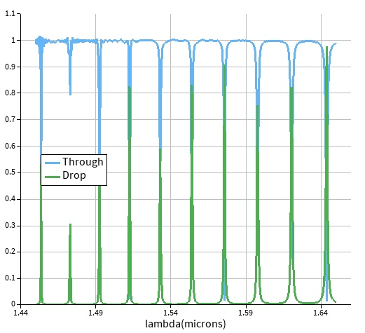
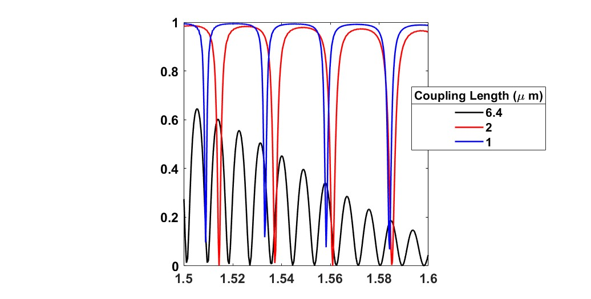
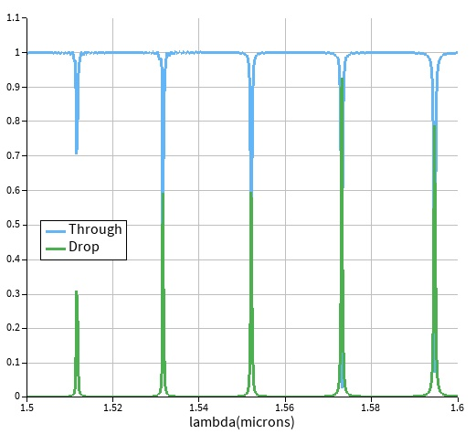
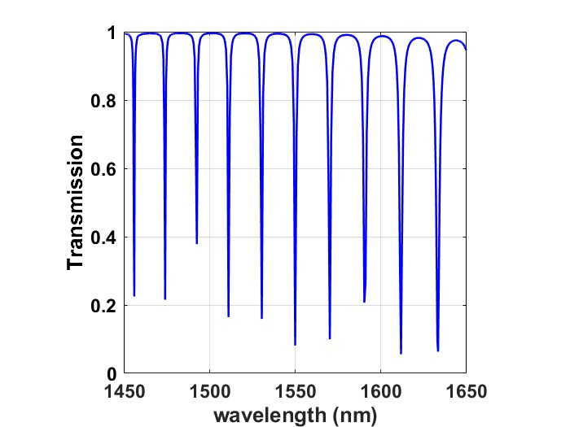

# Silicon Photonic Microring Resonator Design

## 1. Project Overview

This project demonstrates the design and simulation of a passive silicon-photonic microring/racetrack resonator near 1550 nm.

The design targets a resonance wavelength of 1550 nm and a free spectral range (FSR) of approximately 20 nm. The group index calculated during the previous MZI project was used to estimate the resonator radius.

The resonator was first analyzed using varFDTD and then validated using full FDTD simulations. Coupling-length and radius sweeps were subsequently performed to control the loaded quality factor, resonance wavelength, and FSR.

## 2. Design Platform and Targets

| Parameter                | Target             |
| ------------------------ | ------------------ |
| **Platform**             | Silicon photonics  |
| **Silicon thickness**    | 220 nm             |
| **Waveguide width**      | 450 nm             |
| **Nominal bus–ring gap** | 150 nm             |
| **Target wavelength**    | 1550 nm            |
| **Target FSR**           | 20 nm              |
| **Target loaded Q**      | Approximately 2000 |
| **Group index**          | [Insert value]     |

The resonator uses a bus waveguide coupled to a ring or racetrack resonator. The final geometry and radius should be inserted below:

| Parameter                   | Value            |
| --------------------------- | ---------------- |
| **Resonator type**          | [Ring/Racetrack] |
| **Radius**                  | [Insert value]   |
| **Coupling length**         | [Insert value]   |
| **Coupling gap**            | 150 nm           |
| **Straight-section length** | [Insert value]   |

## 3. Design Methodology

The group index obtained from the previous MZI design was used to estimate the resonator size.

For a resonator with round-trip length (L_{\mathrm{rt}}), the FSR is approximately:

```math
\mathrm{FSR} \approx \frac{\lambda_0^2}{n_g L_{\mathrm{rt}}}
```

For an ideal circular ring:

```math
L_{\mathrm{rt}} = 2\pi R
```

For a racetrack resonator:

```math
L_{\mathrm{rt}} = 2\pi R + 2L_s
```

where:

* (R) is the bend radius
* (L_s) is the length of one straight section
* (n_g) is the group index
* (\lambda_0) is the design wavelength

The initial radius was calculated from the target FSR and then rounded to the available geometric precision. This rounding introduced a small difference between the analytical target and the simulated result.

## 4. Initial varFDTD Simulation

The initial ring/racetrack structure was simulated using varFDTD to evaluate the approximate transmission response and identify the resonance behavior.



The varFDTD simulation was used to provide an efficient first estimate before full FDTD validation.

The main quantities extracted were:

* Resonance wavelength
* Free spectral range
* Resonance linewidth
* Through-port transmission
* Approximate loaded quality factor

## 5. Coupling-Length Comparison

Two racetrack resonators were investigated using coupling lengths of:

```math
L_c = 1,\ 2,\ \mathrm{and}\ 6.4\ \mu\mathrm{m}
```

The value of (6.4\ \mu\mathrm{m}) corresponds to the approximate 50/50 coupling length obtained previously for a 150 nm gap on the same waveguide platform.



The coupling length controls the strength of interaction between the bus waveguide and the resonator.

In general:

* Shorter coupling length produces stronger coupling.
* Stronger coupling generally reduces the loaded Q.
* Longer coupling length produces weaker coupling and higher Q.
* Coupling length has only a limited effect on the FSR because the FSR is primarily determined by the resonator round-trip length.
* Coupling changes the resonance contrast and linewidth more strongly than it changes the resonance positions.

## 6. Initial FDTD Validation

The resonator was validated using full FDTD simulation.

The initial FDTD result produced:

| Parameter                | Result                |
| ------------------------ | --------------------- |
| **Resonance wavelength** | Approximately 1552 nm |
| **FWHM linewidth**       | Approximately 0.4 nm  |
| **Loaded Q**             | Approximately 3900    |
| **FSR**                  | Approximately 21 nm   |

The loaded quality factor was calculated from the resonance wavelength and full-width-at-half-maximum linewidth:

```math
Q_{\mathrm{loaded}} = \frac{\lambda_{\mathrm{res}}}{\Delta\lambda_{\mathrm{FWHM}}}
```

Using the approximate values:

```math
Q_{\mathrm{loaded}} \approx \frac{1552\ \mathrm{nm}}{0.4\ \mathrm{nm}} \approx 3900
```



The simulated resonance and FSR are close to the design targets. The small deviations are attributed to:

* Rounding of the calculated radius
* Discrete geometric dimensions
* Numerical mesh resolution
* Approximation in the group-index-based design
* Differences between the ideal analytical model and the complete curved geometry

## 7. Coupling-Length Effect on Q

A coupling-length sweep was performed to study the effect of coupling strength on the resonator response.


The loaded Q was extracted from the resonance linewidth:

```math
Q_{\mathrm{loaded}} = \frac{\lambda_{\mathrm{res}}}{\Delta\lambda_{\mathrm{FWHM}}}
```

The results show that increasing the coupling strength broadens the resonance and decreases the loaded Q. The coupling length also modifies the resonance contrast and through-port transmission.

The FSR and resonance wavelength remain comparatively stable during the coupling-length sweep, confirming that the coupling region mainly controls the resonator loading rather than the round-trip optical path length.

| Coupling length | Resonance wavelength | FSR            | FWHM           | Loaded Q       |
| --------------- | -------------------- | -------------- | -------------- | -------------- |
| **1 µm**        | [Insert value]       | [Insert value] | [Insert value] | [Insert value] |
| **2 µm**        | [Insert value]       | [Insert value] | [Insert value] | [Insert value] |
| **6.4 µm**      | [Insert value]       | [Insert value] | [Insert value] | [Insert value] |

## 8. Radius Sweep

A radius sweep was performed to adjust the FSR and resonance wavelength.


The radius primarily determines the round-trip optical path length:

```math
L_{\mathrm{rt}} \approx 2\pi R
```

for an ideal circular ring. Increasing the radius increases the round-trip length and therefore decreases the FSR:

```math
\mathrm{FSR} \propto \frac{1}{L_{\mathrm{rt}}}
```

The radius was adjusted to move the simulated response toward an FSR of 20 nm and a resonance near 1550 nm.

| Radius             | Resonance wavelength | FSR            | Loaded Q       |
| ------------------ | -------------------- | -------------- | -------------- |
| **[Insert value]** | [Insert value]       | [Insert value] | [Insert value] |
| **[Insert value]** | [Insert value]       | [Insert value] | [Insert value] |
| **[Insert value]** | [Insert value]       | [Insert value] | [Insert value] |

## 9. Final Design

The final design was selected by jointly considering:

* Resonance wavelength
* FSR
* Loaded Q
* Resonance linewidth
* Transmission response
* Geometric rounding and practical layout dimensions

| Parameter                 | Final result          |
| ------------------------- | --------------------- |
| **Resonance wavelength**  | Approximately 1550 nm |
| **FSR**                   | Approximately 20 nm   |
| **Loaded Q**              | Approximately 2000    |
| **FWHM linewidth**        | [Insert value]        |
| **Ring/racetrack radius** | [Insert value]        |
| **Coupling length**       | [Insert value]        |
| **Coupling gap**          | 150 nm                |

The expected linewidth for a resonance near 1550 nm and loaded Q of approximately 2000 is:

```math
\Delta\lambda_{\mathrm{FWHM}} \approx \frac{1550\ \mathrm{nm}}{2000} \approx 0.775\ \mathrm{nm}
```

The final simulated value should be reported from the actual FDTD spectrum.



## 10. Near-Resonance Field Distribution

The electric-field distribution was plotted at a wavelength close to resonance to visualize coupling into the ring and circulating field enhancement.


The field map illustrates:

* Input-bus propagation
* Coupling from the bus into the resonator
* Field circulation within the ring
* Resonant enhancement near the selected wavelength
* Output transmission through the bus waveguide

| Parameter           | Value              |
| ------------------- | ------------------ |
| **Wavelength**      | [Insert value]     |
| **Field component** | [Insert component] |
| **Plot quantity**   | [Insert quantity]  |

## 11. Performance Tolerances

The following tolerances are reasonable initial design criteria for a simulation-based portfolio project:

| Parameter                | Acceptance criterion |
| ------------------------ | -------------------- |
| **Resonance wavelength** | ±1 nm                |
| **FSR**                  | ±1 nm or ±5%         |
| **Loaded Q**             | ±10–20%              |
| **FWHM linewidth**       | ±10–20%              |

These are design acceptance limits, not measured fabrication statistics. Actual tolerances depend on:

* Waveguide-width variation
* Coupling-gap variation
* Radius and length errors
* Sidewall roughness
* Material-index uncertainty
* Mesh and wavelength resolution
* Temperature

## 12. Conclusions

A passive silicon-photonic microring/racetrack resonator was designed for operation near 1550 nm with a target FSR of approximately 20 nm.

The design workflow demonstrated that:

* The resonator radius primarily controls the FSR.
* Coupling length strongly controls the loaded Q and resonance linewidth.
* Coupling length has a smaller effect on resonance wavelength and FSR.
* The initial FDTD design produced a resonance near 1552 nm, a linewidth of approximately 0.4 nm, a loaded Q of approximately 3900, and an FSR of approximately 21 nm.
* Subsequent coupling-length and radius sweeps were used to move the design toward a resonance near 1550 nm, an FSR near 20 nm, and a loaded Q near 2000.
* Differences between analytical estimates and full-wave results arise from geometric rounding, numerical resolution, and the detailed resonator geometry.
