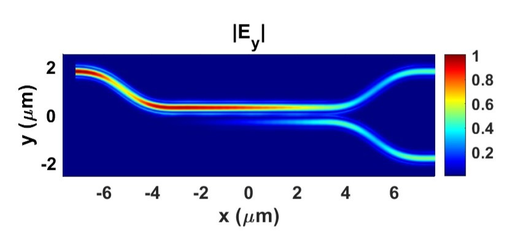

# Silicon Photonic Directional Coupler

This project demonstrates the design and simulation of a silicon-photonic directional coupler using Lumerical FDE and FDTD.

## Key parameters

| Parameter | Value |
|---|---:|
| Wavelength | 1550 nm |
| Waveguide width | 450 nm |
| Nominal gap | 150 nm |
| FDE coupling length | 7.96 µm |
| Bent-device FDTD coupling length | 6.4 µm |

## Main result
  
## Detailed project summary

See [Summary.md](Summary.md).

## Repository contents

- `figures/` — simulation figures
- `simulation_and_script_files/` —  Lumerical simulation files and scripts
- `data/` — processed simulation data
- `Summary.md` — detailed design analysis
