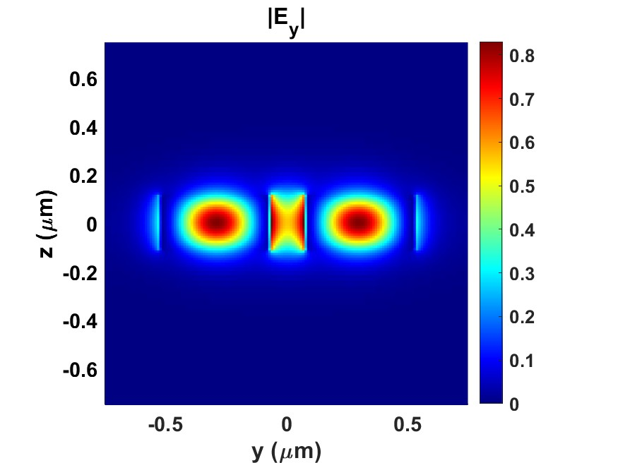
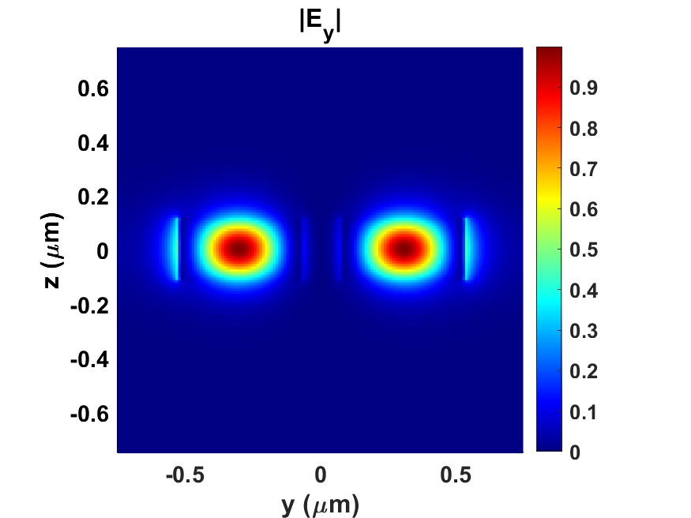
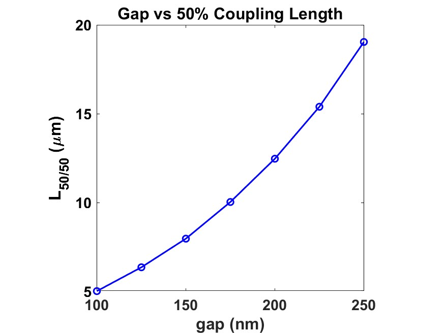
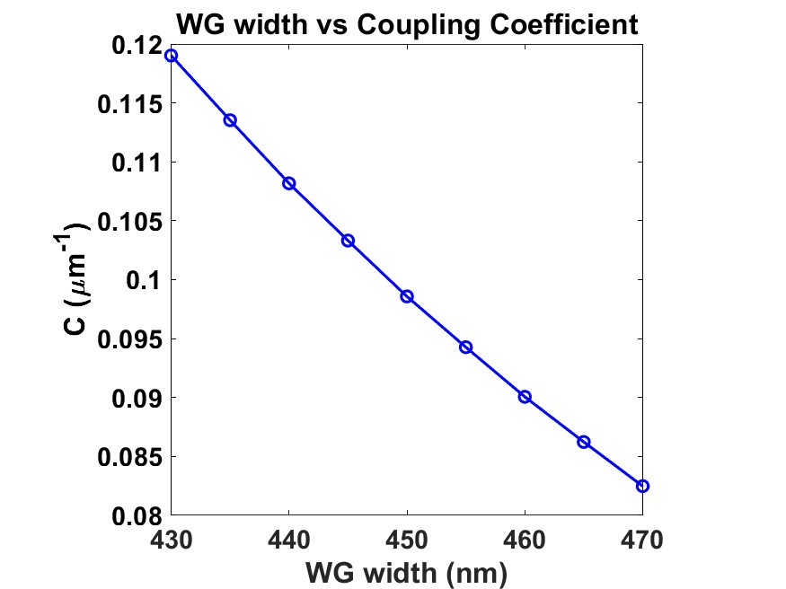
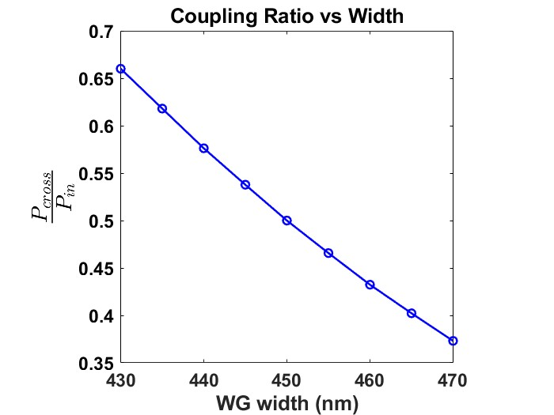
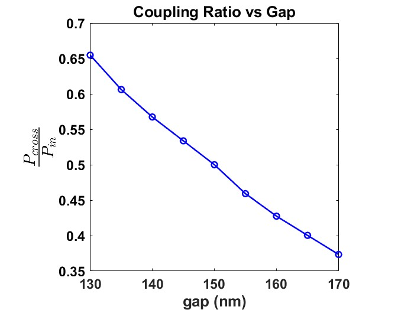

# Silicon Photonic Directional Coupler
### Overview
This project demonstrates the design and simulation of a silicon-photonic directional coupler using Lumerical FDE and FDTD solvers.
The device consists of two parallel waveguides designed to transfer optical power through evanescent coupling. The analysis includes:  • Even/odd supermode analysis  
• Coupling-coefficient extraction using FDE  
• Gap and waveguide-width sweeps  
• Coupling-length analysis  
• Wavelength-dependent power splitting  
• Monte Carlo tolerance analysis  
• FDTD validation using straight and bent waveguide geometries  
The nominal design uses a waveguide width of 450 nm and a waveguide gap of $$150\ \mathrm{nm}$$ at a target wavelength of $$1550\ \mathrm{nm}$$.

### Device concept
The coupling coefficient was extracted from the effective-index difference between the even and odd supermodes:  
$$C=\frac{\Delta\beta}{2}$$  
where:  
$\Delta\beta= \frac{2\pi}{\lambda} \left|n_{\mathrm{eff,even}}-n_{\mathrm{eff,odd}}\right|$  
The cross-port power was calculated as:  
$\frac{P_{\mathrm{cross}}}{P_0}= \sin^2(CL)=\kappa^2$  
where $L$ is the parallel coupling length, and $\kappa$ is the field coupling.
  
### FDE mode analysis
The FDE solver was used to calculate the two coupled supermodes of the directional coupler. The mode profiles show the expected symmetric and antisymmetric field distributions.  
**FDE even mode profile**
  
**FDE odd mode profile**  

## Coupling-length and parameter sweeps
### Gap dependence
Increasing the gap reduces the coupling coefficient and therefore increases the coupling length required for 50/50 power transfer.
The calculated 50/50 coupling length increases from approximately $$5\ \mathrm{\mu m}$$ at a $$100\ \mathrm{nm}$$ gap to approximately $$19\ \mathrm{\mu m}$$ at a $$250\ \mathrm{nm}$$ gap.  
**Gap versus coupling length**  
  
### Waveguide-width dependence
The waveguide width was varied by approximately $$\pm20\ \mathrm{nm}$$ around the nominal width of $$450\ \mathrm{nm}$$.
**WG width versus coupling coefficient**
  
### Wavelength-dependent splitting
The wavelength response was calculated using the extracted coupling coefficient and the selected coupling length.
The through-port power decreases with wavelength while the coupled-port power increases. The two output powers cross close to the 50/50 splitting point, demonstrating wavelength-dependent power division.

### Robustness to dimensional variations
The effect of dimensional variations was evaluated by independently varying the waveguide width and gap around their nominal values.
These results show the sensitivity of the nominal coupling design to fabrication-related variations in waveguide width and separation.
  
  
### Monte Carlo tolerance analysis
A 100-sample Monte Carlo analysis was performed by randomly varying:  
• Waveguide 1 width  
• Waveguide 2 width  
• Waveguide gap  
The coupling length was kept fixed, and the coupling coefficient was recalculated for every geometry.  
The Monte Carlo results provide a statistical estimate of the expected coupling-coefficient variation caused by dimensional deviations.
| Metric | Result |
|--------|--------|
| Number of samples | 100 |
| Nominal waveguide width | 450 nm |
| Nominal gap | 150 nm |
| Width variation | Approximately ±20 nm |
| Gap variation | Approximately ±20 nm |
| Mean coupling coefficient | 0.10220 μm⁻¹ |
| Standard deviation | 0.00866 μm⁻¹ |
| Minimum coupling coefficient | 0.08629 μm⁻¹ |
| Maximum coupling coefficient | 0.13128 μm⁻¹ |

## FDTD validation
### Straight-waveguide coupler
The ideal parallel-waveguide structure was simulated using FDTD. Power transfer between the two waveguides was monitored as a function of propagation distance and compared with the FDE prediction.
The FDE model provides the coupling period through the extracted coupling coefficient:  
$P_{\mathrm{cross}}(L)=\sin^2(CL)$  
The straight-waveguide FDTD simulation was used to verify this analytical coupling behavior.
## Bent-transition coupler
A more realistic structure was then simulated, with the waveguides bending toward the coupling region and separating after the interaction region.
The broadband FDTD simulation produced the wavelength-dependent transmission at the through and coupled ports.
The 50/50 coupling length obtained from the bent-device FDTD simulation was approximately $$6.4\ \mathrm{\mu m}$$, compared with approximately $$7.96\ \mathrm{\mu m}$$ predicted by the ideal parallel-waveguide FDE model.
This difference is attributed to effects included in the full FDTD geometry but not in the ideal FDE model, including:  
• Bend transitions  
• Mode evolution before the coupling region  
• Mode mismatch at the coupling-region entrance  
• Effective interaction-length differences  

### Key results

| Parameter | Result |
|----------|--------|
| Nominal waveguide width | 450 nm |
| Nominal gap | 150 nm |
| Target wavelength | 1550 nm |
| FDE coupling coefficient at nominal geometry | 0.0986 μm⁻¹ |
| FDE 50/50 coupling length | Approximately 7.96 μm |
| Bent-device FDTD 50/50 coupling length | Approximately 6.4 μm |
| Monte Carlo samples | 100 |

### Tools
• Ansys Lumerical FDE  
• Ansys Lumerical FDTD  
• MATLAB  
• GitHub  

### Repository structure
directional-coupler/  
├── README.md  
├── figures/  
│   ├── even_mode_profile.jpg  
│   ├── odd_mode_profile.jpg  
│   ├── gap_vs_50_percent_coupling_length.jpg  
│   ├── gap_vs_coupling_coefficient.png  
│   ├── width_vs_coupling_coefficient.png  
│   ├── wavelength_vs_coupling.png  
│   ├── monte_carlo_3d_scatter.png  
│   ├── monte_carlo_histograms.png  
│   └── bent_coupler_transmission.png  
├── scripts/  
│   ├── lumerical/  
├── simulation files/ 
│   ├── odd_mode_profile.jpg  
│   ├── gap_vs_50_percent_coupling_length.jpg   
 
