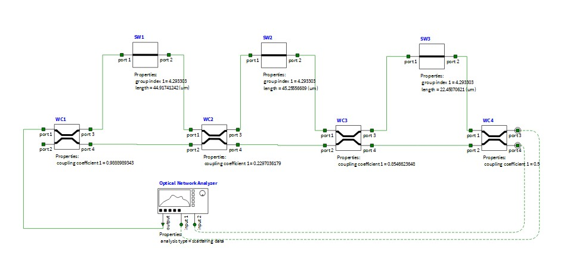
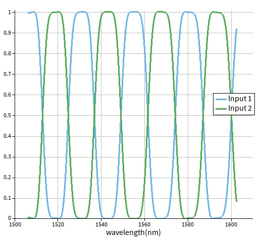

# Optical Half-Band FIR Filter

Brief INTERCONNECT circuit-level simulation of a three-MZI optical half-band FIR filter based on the lattice architecture reported by Jinguji and Oguma [1].

The original design was adapted to the silicon-photonic platform used in the previous component-design projects:

- Center wavelength: 1550 nm
- Target FSR: 25 nm
- Waveguide effective index: $$n_{\mathrm{eff}}=2.291852$$
- Waveguide group index: $$n_g=4.293303$$

The MZI delay lengths were recalculated using the previously extracted waveguide parameters:

$$
\Delta L\approx\frac{\lambda_0^2}{n_g\mathrm{FSR}}
$$

The resulting component parameters were used to update the INTERCONNECT circuit model.

## Results

The simulation shows the transmission response of the input and output ports over wavelength.

## Reference

[1] K. Jinguji and M. Oguma, “Optical Half-Band Filters,” *Journal of Lightwave Technology*, vol. 18, 2000.
